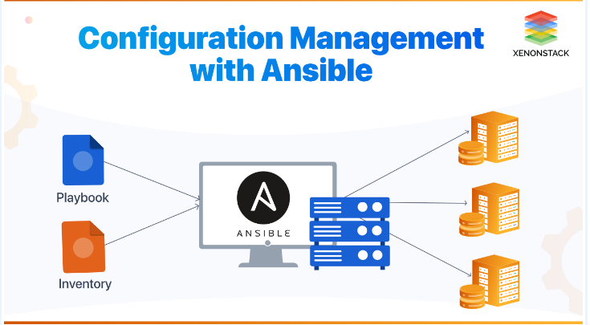
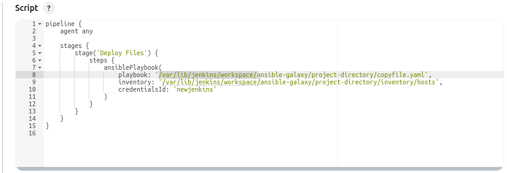

# Copying Files from Control Node to Managed Node Using Ansible

Ansible is a powerful open-source automation tool used for server configuration management. To begin, ensure you have a managed node where files will be transferred. This can be achieved by creating an additional server using AWS EC2 instances, VirtualBox, or any other virtualization platform.



## Step A: Establish SSH Connection Between Control Node and Managed Node

### 1. Install SSH

Ensure that the SSH client is installed on your local machine (control node) and that the SSH server is installed on the remote server (managed node). Most Linux distributions come with SSH pre-installed. You can verify SSH installation by running:

```bash
ssh -v
```

If SSH is not installed, you can install it using the following commands:

- **For Debian/Ubuntu:**

  ```bash
  sudo apt install openssh-server
  ```

- **For CentOS/RHEL:**

  ```bash
  sudo yum install openssh-server
  ```

### 2. Ensure Network Access

Confirm that both servers can communicate over the network. You will need the IP address or hostname of the remote server for this.

### 3. Generate SSH Key Pair

Generate an SSH key pair on the control node by running the following command:

```bash
ssh-keygen -t rsa -b 2048 -C "your_email@example.com"
```

### 4. Specify Key File Location

During the key generation process, you will be prompted to specify a file location for saving the key. Press `Enter` to accept the default location (`~/.ssh/id_rsa`), or provide a custom file path.

### 5. Copy Public Key to Managed Node

Transfer the public key from the control node (`id_rsa.pub`) to the `~/.ssh/` directory of the managed node, renaming it as `authorized_keys`.

### 6. Test SSH Connection

Attempt to connect to the managed node using SSH:

```bash
ssh user@192.168.56.105
```

Replace `user` with the username of your managed node and `192.168.56.105` with its IP address. To find the IP address of the managed node, you can use commands like `ifconfig` or `ip addr`.

If the connection is successful, you have established SSH connectivity between the control node and the managed node.

## Step B: Write Ansible Playbook and Inventory File

### 1. Create the Ansible Playbook

An Ansible playbook defines the tasks to be executed, including the target hosts (managed nodes), the source files, and their destination on the managed node. This serves as the blueprint for automating server configuration.

### 2. Create the Inventory File

The inventory file lists the managed nodes, specifying details like the server name, IP address, and SSH port. This file tells Ansible which servers to manage.

### 3. Use Ansible Vault for Security

To secure sensitive information such as passwords in your inventory file, use Ansible Vault to encrypt the data. Create an encrypted file with the following command:

```bash
ansible-vault create vault.yaml
```

This will create a file named `vault.yaml`, where you can store encrypted passwords and other sensitive information.

### 4. Copy Files to Jenkins Workspace

Ensure that all relevant files are copied into the Jenkins workspace. The default path is typically:

```bash
/var/lib/jenkins/workspace/your-folder-name/*
```

## Step C: Automate the Process with Jenkins Pipeline

### 1. Create a New Job

In Jenkins, create a new job using the Pipeline methodology. Provide a meaningful name and description for the job.

### 2. Define the Pipeline Script

In the Pipeline section of the job configuration, set the definition to "Pipeline script" and enter your pipeline code to automate the Ansible tasks.



### 3. Save and Execute the Job

Save the job configuration and trigger the build. Jenkins will execute the pipeline script, running the Ansible playbook to copy files from the control node to the managed node.


### 4. Verify the File Transfer

After the Jenkins job completes, check the managed node to ensure that the files have been transferred successfully.

By following these steps, you can set up secure SSH connections between your control and managed nodes, write efficient Ansible playbooks and inventory files, and automate file transfers using Jenkins pipelines.


